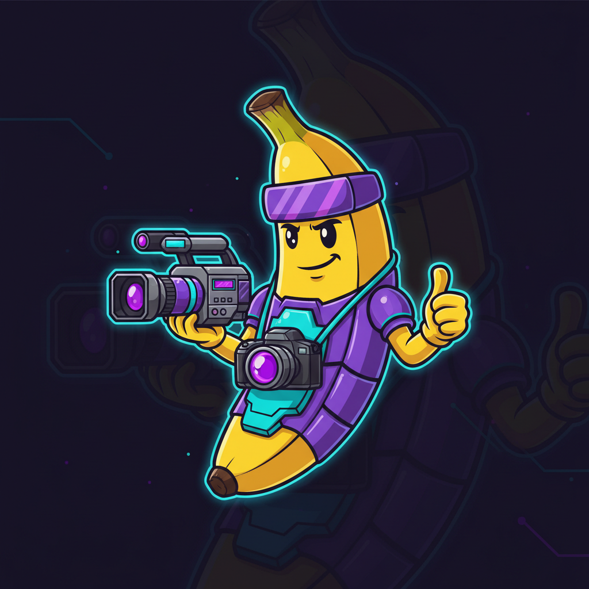

# OpenCode Nanobanana

<p align="center">
  
</p>

> Visual AI capabilities for OpenCode - FREE image generation, video generation, and more.

[](https://www.npmjs.com/package/opencode-nanobanana)
[](https://www.npmjs.com/package/opencode-nanobanana)
[](LICENSE)
[](https://github.com/nicholasoxford/omo)

**[View on npm](https://www.npmjs.com/package/opencode-nanobanana)** | **[GitHub](https://github.com/48Nauts-Operator/opencode-nanobanana)**

An OpenCode plugin providing comprehensive visual AI capabilities powered by Google's Gemini API. **FREE image generation** with Nano Banana (Gemini 2.5 Flash), video generation with Veo 3, and more.

## Features

- **🎬 Storyboard Video Generation** - Create multi-scene videos with transitions, character consistency, and audio mixing
- **🎥 Video Generation** - Generate videos from text prompts with Veo 3.1 and native audio
- **🖼️ Image to Video** - Animate static images into videos with motion and audio
- **🎥 Video Extension** - Extend existing videos with new content using Veo 3.1
- **🎨 Image Generation** - Generate images using Nano Banana (Imagen 3)
- **📱 App Asset Pipelines** - Generate complete icon sets for iOS, Android, macOS, and Web
- **🔍 Visual Analysis** - Analyze images and screenshots
- **🎞️ Video Processing** - FFmpeg utilities for concatenation, transitions, and audio mixing

## Installation

```bash
npm install opencode-nanobanana
```

Or add to your OpenCode config (`~/.opencode/package.json`):

```json
{
  "dependencies": {
    "opencode-nanobanana": "^0.3.0"
  }
}
```

### Requirements

- Node.js >= 18.0.0
- FFmpeg (for video features)

#### Installing FFmpeg

**macOS:**
```bash
brew install ffmpeg
```

**Ubuntu/Debian:**
```bash
sudo apt update
sudo apt install ffmpeg
```

**Windows:**
Download from [ffmpeg.org](https://ffmpeg.org/download.html) or use:
```bash
choco install ffmpeg
```

## Quick Start

```typescript
import {
  generateVideo,
  imageToVideo,
  generateStoryboardVideo,
  extendVideo
} from 'opencode-nanobanana';

// Generate a video from a text prompt
const video = await generateVideo({
  apiKey: 'your-gemini-api-key',
  prompt: 'A serene mountain landscape at sunrise',
  outputPath: './mountain.mp4'
});

// Animate an image
const animated = await imageToVideo({
  apiKey: 'your-gemini-api-key',
  imagePath: './photo.jpg',
  prompt: 'Slow camera pan from left to right',
  outputPath: './animated.mp4'
});

// Generate a multi-scene storyboard video
const storyboard = await generateStoryboardVideo({
  apiKey: 'your-gemini-api-key',
  scenes: [
    'A serene mountain landscape at sunrise',
    'A hiker reaching the summit',
    'Panoramic view from the peak'
  ],
  style: 'cinematic',
  transition: 'crossfade',
  outputPath: './mountain-journey.mp4'
});
```

## Storyboard Video Generation

The `generateStoryboardVideo` tool creates multi-scene videos by generating individual scenes in parallel and stitching them together with professional transitions.

### Features

- **Parallel Scene Generation** - All scenes generate simultaneously for maximum speed
- **Professional Transitions** - Cut, crossfade, or fade transitions between scenes
- **Character Consistency** - Maintain consistent characters across scenes using reference images
- **Native Audio** - Veo 3.1 generates audio automatically for each scene
- **Background Music** - Add background music with volume control
- **Progress Tracking** - Detailed progress logs for each scene

### API Reference

```typescript
interface StoryboardVideoOptions {
  /** Array of scene descriptions */
  scenes: string[];

  /** Style to apply to all scenes (e.g., 'cinematic', 'commercial') */
  style?: string;

  /** Character description to prepend to each scene for consistency */
  characterDescription?: string;

  /** Array of reference image paths for character/scene consistency (max 3) */
  referenceImages?: string[];

  /** Aspect ratio for all scenes (default: '16:9') */
  aspectRatio?: '16:9' | '9:16' | '1:1';

  /** Transition type between scenes (default: 'crossfade') */
  transition?: 'cut' | 'crossfade' | 'fade';

  /** Transition duration in seconds (default: 0.5) */
  transitionDuration?: number;

  /** Enable native Veo audio generation (default: true) */
  generateAudio?: boolean;

  /** Path to background music audio file (optional) */
  backgroundMusic?: string;

  /** Volume level for background music (0.0-1.0, default: 0.3) */
  musicVolume?: number;

  /** Output path for the final video */
  outputPath?: string;

  /** Gemini API key */
  apiKey: string;
}
```

### Examples

#### Basic Multi-Scene Video

```typescript
const result = await generateStoryboardVideo({
  apiKey: 'your-api-key',
  scenes: [
    'A peaceful coffee shop in the morning',
    'A barista expertly crafting latte art',
    'A customer enjoying their coffee with a smile'
  ],
  style: 'commercial',
  transition: 'crossfade',
  transitionDuration: 0.5,
  outputPath: './coffee-shop-ad.mp4'
});

console.log(`Generated ${result.successCount} scenes in ${result.totalTime / 1000}s`);
```

#### Character Consistency

Use character descriptions and reference images to maintain consistent characters across all scenes:

```typescript
const result = await generateStoryboardVideo({
  apiKey: 'your-api-key',

  // Character consistency features
  characterDescription: 'A young woman with long brown hair wearing a red jacket',
  referenceImages: ['./character-ref-1.jpg', './character-ref-2.jpg'],

  scenes: [
    'Walking through a forest path',
    'Discovering a hidden waterfall',
    'Setting up camp at sunset',
    'Roasting marshmallows by the campfire'
  ],

  style: 'cinematic',
  aspectRatio: '16:9',
  transition: 'crossfade',
  outputPath: './adventure-story.mp4'
});
```

**Tips for Character Consistency:**
- Provide 1-3 reference images showing the character from different angles
- Include detailed character descriptions (appearance, clothing, distinguishing features)
- Keep scene descriptions focused on actions/settings rather than re-describing the character

#### Background Music

Add background music to your storyboard while preserving native Veo audio:

```typescript
const result = await generateStoryboardVideo({
  apiKey: 'your-api-key',
  scenes: [
    'Product reveal with dramatic lighting',
    'Close-up of premium features',
    'Happy customer testimonials'
  ],

  // Audio options
  generateAudio: true,              // Native Veo audio (footsteps, ambient sounds)
  backgroundMusic: './upbeat.mp3',  // Background music track
  musicVolume: 0.3,                 // 30% volume for background music

  style: 'commercial',
  transition: 'fade',
  outputPath: './product-demo.mp4'
});
```

**Audio Mixing Behavior:**
- `generateAudio: true` - Veo generates natural audio for each scene (footsteps, voices, ambient sounds)
- `backgroundMusic` - Your music track plays underneath at the specified volume
- Final video has both native audio (100% volume) and background music (musicVolume % volume)

#### Different Transitions

```typescript
// Cut transition (no transition effect, immediate cut)
const cutVideo = await generateStoryboardVideo({
  apiKey: 'your-api-key',
  scenes: ['Scene 1', 'Scene 2', 'Scene 3'],
  transition: 'cut',  // Instant cuts between scenes
});

// Crossfade transition (blend between scenes)
const crossfadeVideo = await generateStoryboardVideo({
  apiKey: 'your-api-key',
  scenes: ['Scene 1', 'Scene 2', 'Scene 3'],
  transition: 'crossfade',
  transitionDuration: 1.0,  // 1 second crossfade
});

// Fade transition (fade to black, then fade in)
const fadeVideo = await generateStoryboardVideo({
  apiKey: 'your-api-key',
  scenes: ['Scene 1', 'Scene 2', 'Scene 3'],
  transition: 'fade',
  transitionDuration: 0.5,  // 0.5 second fade
});
```

## Video Extension

The `extendVideo` tool seamlessly extends an existing video with new content using Veo 3.1's video extension API.

### API Reference

```typescript
interface ExtendVideoOptions {
  /** Path to the existing video to extend */
  videoPath: string;

  /** Description of the extension content */
  prompt: string;

  /** Aspect ratio for the extended video (default: '16:9') */
  aspectRatio?: '16:9' | '9:16' | '1:1';

  /** Resolution for the extended video (default: '720p') */
  resolution?: '720p' | '1080p';

  /** Output path for the extended video (optional, defaults to temp file) */
  outputPath?: string;

  /** Gemini API key */
  apiKey: string;
}
```

### Examples

#### Basic Video Extension

```typescript
const result = await extendVideo({
  apiKey: 'your-api-key',
  videoPath: './intro-scene.mp4',
  prompt: 'The camera pans to reveal a stunning sunset over the ocean',
  outputPath: './extended-intro.mp4'
});

console.log(`Extended video: ${result.videoPath}`);
console.log(`Generation time: ${result.generationTime / 1000}s`);
```

#### High-Resolution Extension

```typescript
const result = await extendVideo({
  apiKey: 'your-api-key',
  videoPath: './product-showcase.mp4',
  prompt: 'Text appears: "Available now at our stores"',
  resolution: '1080p',
  aspectRatio: '16:9',
  outputPath: './product-showcase-with-cta.mp4'
});
```

#### Combining Storyboard with Extension

```typescript
// First, create a storyboard
const storyboard = await generateStoryboardVideo({
  apiKey: 'your-api-key',
  scenes: [
    'A product sits on a pedestal',
    'The product rotates slowly'
  ],
  style: 'commercial',
  outputPath: './product-base.mp4'
});

// Then extend it with a call-to-action
const final = await extendVideo({
  apiKey: 'your-api-key',
  videoPath: storyboard.videoPath,
  prompt: 'Text overlay fades in: "Order now - Limited time offer"',
  outputPath: './product-final.mp4'
});
```

## Video Generation

The `generateVideo` tool creates videos from text prompts using Veo 3.1 with native audio support.

### API Reference

```typescript
interface GenerateVideoOptions {
  /** Description of the video to generate */
  prompt: string;

  /** Aspect ratio for the video (default: '16:9') */
  aspectRatio?: '16:9' | '9:16' | '1:1';

  /** Resolution for the video (default: '720p') */
  resolution?: '720p' | '1080p';

  /** Video duration in seconds (default: 8) */
  duration?: 4 | 6 | 8;

  /** Enable native audio generation (default: true) */
  generateAudio?: boolean;

  /** Output path for the video (optional, defaults to temp file) */
  outputPath?: string;

  /** Gemini API key */
  apiKey: string;
}
```

### Examples

#### Basic Video Generation

```typescript
const result = await generateVideo({
  apiKey: 'your-api-key',
  prompt: 'A serene mountain landscape at sunrise',
  outputPath: './mountain.mp4'
});

console.log(`Video created: ${result.videoPath}`);
console.log(`Generation time: ${result.generationTime / 1000}s`);
```

#### High Quality with Custom Settings

```typescript
const result = await generateVideo({
  apiKey: 'your-api-key',
  prompt: 'A bustling city street at night with neon lights',
  resolution: '1080p',
  duration: 8,
  aspectRatio: '16:9',
  generateAudio: true,
  outputPath: './city-night.mp4'
});
```

#### Silent Video (No Audio)

```typescript
const result = await generateVideo({
  apiKey: 'your-api-key',
  prompt: 'A peaceful garden with blooming flowers',
  generateAudio: false,
  outputPath: './silent-garden.mp4'
});
```

#### Short Duration Video

```typescript
const result = await generateVideo({
  apiKey: 'your-api-key',
  prompt: 'Product logo reveal with dynamic motion',
  duration: 4,  // 4 second video
  resolution: '1080p',
  aspectRatio: '1:1',  // Square format for social media
  outputPath: './logo-reveal.mp4'
});
```

## Image to Video

The `imageToVideo` tool animates static images into videos using Veo 3.1 with native audio support.

### API Reference

```typescript
interface ImageToVideoOptions {
  /** Path to the image to animate */
  imagePath: string;

  /** Description of the animation */
  prompt: string;

  /** Aspect ratio for the video (default: '16:9') */
  aspectRatio?: '16:9' | '9:16' | '1:1';

  /** Resolution for the video (default: '720p') */
  resolution?: '720p' | '1080p';

  /** Video duration in seconds (default: 8) */
  duration?: 4 | 6 | 8;

  /** Enable native audio generation (default: true) */
  generateAudio?: boolean;

  /** Output path for the video (optional, defaults to temp file) */
  outputPath?: string;

  /** Gemini API key */
  apiKey: string;
}
```

### Examples

#### Basic Image Animation

```typescript
const result = await imageToVideo({
  apiKey: 'your-api-key',
  imagePath: './landscape.jpg',
  prompt: 'Slow camera pan from left to right',
  outputPath: './animated-landscape.mp4'
});

console.log(`Animated video: ${result.videoPath}`);
```

#### Product Showcase

```typescript
const result = await imageToVideo({
  apiKey: 'your-api-key',
  imagePath: './product.png',
  prompt: 'Product rotates 360 degrees on a pedestal',
  resolution: '1080p',
  duration: 6,
  generateAudio: true,
  outputPath: './product-showcase.mp4'
});
```

#### Portrait Animation

```typescript
const result = await imageToVideo({
  apiKey: 'your-api-key',
  imagePath: './portrait.jpg',
  prompt: 'Subtle breathing motion and eye blinks',
  aspectRatio: '9:16',  // Vertical format
  duration: 4,
  outputPath: './animated-portrait.mp4'
});
```

#### Logo Animation for Social Media

```typescript
const result = await imageToVideo({
  apiKey: 'your-api-key',
  imagePath: './logo.png',
  prompt: 'Logo pulses with energy and glows',
  aspectRatio: '1:1',  // Square format
  duration: 4,
  resolution: '1080p',
  generateAudio: false,  // Silent for social media
  outputPath: './logo-animation.mp4'
});
```

## Video Generation Options (Veo 3.1)

All video tools use Veo 3.1 with these capabilities:

- **Resolutions**: `720p` (default) or `1080p`
- **Durations**: 4, 6, or 8 seconds (default: 8s)
- **Aspect Ratios**: `16:9`, `9:16`, or `1:1`
- **Native Audio**: Automatic audio generation (can be disabled)
- **Reference Images**: Up to 3 reference images for character/scene consistency

## FFmpeg Utilities

The plugin includes comprehensive FFmpeg utilities for video processing:

```typescript
import {
  checkFfmpegInstalled,
  concatenateVideos,
  getVideoDuration,
  trimVideo,
  addAudioTrack
} from 'opencode-nanobanana';

// Check if FFmpeg is installed
const isInstalled = await checkFfmpegInstalled();

// Concatenate videos with transitions
await concatenateVideos(
  ['scene1.mp4', 'scene2.mp4', 'scene3.mp4'],
  'output.mp4',
  {
    transition: 'crossfade',
    transitionDuration: 0.5
  }
);

// Get video duration
const duration = await getVideoDuration('video.mp4');

// Trim a video
await trimVideo('input.mp4', 5.0, 10.0, 'trimmed.mp4');

// Add audio track (mixes with existing audio)
await addAudioTrack('video.mp4', 'music.mp3', 'output.mp4', 0.3);
```

## Error Handling

The storyboard tool handles partial failures gracefully:

```typescript
const result = await generateStoryboardVideo({
  apiKey: 'your-api-key',
  scenes: [
    'Valid scene 1',
    'Valid scene 2',
    'Invalid scene that might fail',
    'Valid scene 3'
  ]
});

// Check results
console.log(`Success: ${result.successCount} scenes`);
console.log(`Failed: ${result.failureCount} scenes`);

// Video is still created with successful scenes
if (result.successCount > 0) {
  console.log(`Video saved to: ${result.videoPath}`);
}
```

## Progress Tracking

Both video tools provide detailed progress logging:

```typescript
const result = await generateStoryboardVideo({
  apiKey: 'your-api-key',
  scenes: ['Scene 1', 'Scene 2', 'Scene 3']
});

// Console output shows:
// 🎬 Starting storyboard generation with 3 scene(s)
// ⚙️  Configuration:
//    - Aspect ratio: 16:9
//    - Transition: crossfade (0.5s)
//    - Audio: enabled
//
// 📹 Generating scenes...
//    [1/3] Starting: "Scene 1"
//    ✅ [1/3] Completed in 12.3s
//    [2/3] Starting: "Scene 2"
//    ✅ [2/3] Completed in 11.8s
//    [3/3] Starting: "Scene 3"
//    ✅ [3/3] Completed in 13.1s
//
// 🎞️  Stitching 3 scene(s) together...
//    - Transition: crossfade
//    - Duration: 0.5s
//
// ✨ Storyboard generation complete!
// 📊 Summary:
//    - Total time: 45.2s
//    - Scenes generated: 3/3
//    - Average scene time: 12.4s
//    - Success rate: 100%
// 📁 Output: ./output.mp4
```

## Best Practices

### Scene Descriptions

- Be specific and descriptive for best results
- Include camera movements, lighting, and mood
- Keep each scene focused on a single moment or action

**Good:**
```typescript
scenes: [
  'Close-up of a chef\'s hands carefully plating a gourmet dish',
  'Wide shot of an elegant restaurant interior with soft lighting',
  'Customer\'s face lighting up as they taste the food'
]
```

**Less Effective:**
```typescript
scenes: [
  'A chef',  // Too vague
  'Restaurant',  // Lacks detail
  'Eating'  // No context or mood
]
```

### Character Consistency

- Use both `characterDescription` and `referenceImages` together for best results
- Provide 2-3 reference images from different angles
- Be specific about distinguishing features (hair, clothing, accessories)

### Performance

- Scenes generate in parallel - 10 scenes take roughly the same time as 1 scene
- Average scene generation: 10-15 seconds
- FFmpeg stitching is fast (< 5 seconds for most videos)
- Use `720p` for faster generation, `1080p` for final production

### Audio

- Native Veo audio is high quality and scene-appropriate
- Background music should be instrumental (avoid vocals conflicting with scene audio)
- Recommended `musicVolume`: 0.2-0.4 for background ambiance

## Troubleshooting

### FFmpeg Not Found

```
Error: FFmpeg is not installed or not available in PATH
```

**Solution:** Install FFmpeg using the instructions in the [Requirements](#requirements) section.

### API Rate Limits

If you hit API rate limits, reduce the number of parallel scenes or add delays between generations.

### Memory Issues

For long storyboards (10+ scenes), ensure you have sufficient disk space for temporary files (each scene is ~5-10 MB).

## TypeScript Support

Full TypeScript support with comprehensive type definitions:

```typescript
import type {
  StoryboardVideoOptions,
  StoryboardVideoResult,
  ExtendVideoOptions,
  ExtendVideoResult,
  ConcatenateOptions
} from 'opencode-nanobanana';
```

## Examples

Check out the example scripts in the repository:

- `test-storyboard-basic.ts` - Basic multi-scene storyboard
- `test-storyboard-character.ts` - Character consistency example
- `test-storyboard-music.ts` - Background music example
- `test-video-extend.ts` - Video extension examples

## License

MIT

## Contributing

Contributions are welcome! Please open an issue or pull request.

## Support

For issues, questions, or feature requests, please open an issue on GitHub.
